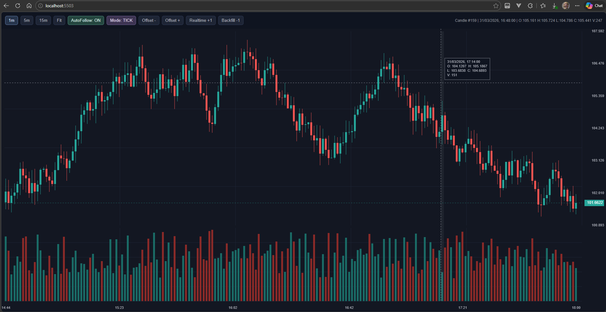

# domzack-chart-demo

Demo mínima da `domzack-chart-lib` contendo apenas o essencial para o usuário final:

- `public/index.html`
- `public/css/styles.css`
- `public/js/main.js`
- `public/vendor/index.global.js`
- `public/screenshot.png`
- `HELP.md`
- `api.md`
- `README.md`

## Como usar

1. Abra `public/index.html` no navegador.
2. Pronto: a biblioteca é carregada via CDN.

## Estrutura

```text
public/
  index.html
  css/styles.css
  js/main.js
  vendor/index.global.js
  screenshot.png
HELP.md
api.md
README.md
```

## Biblioteca usada no HTML

```html
<script src="./vendor/index.global.js"></script>
```

## Preview



## Documentação

- Guia visual + screenshot: [HELP.md](./HELP.md)
- Documentação detalhada da API: [api.md](./api.md)

## Observação

Se quiser rodar com servidor local (opcional), use qualquer servidor estático de sua preferência.
